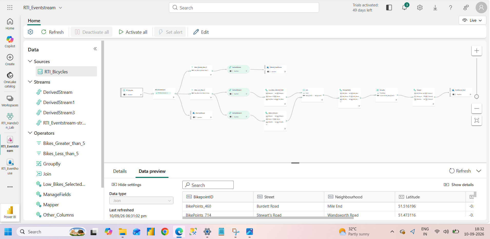

# Microsoft Fabric – Real-Time Bicycle Monitoring & Analytics


## Project Overview

This project demonstrates the implementation of a **real-time bicycle monitoring and analytics solution using Microsoft Fabric Real-Time Intelligence**.

The solution ingests bicycle availability events through **Microsoft Fabric Eventstream**, processes the streaming data using derived streams and real-time transformation operators, stores processed data in **Eventhouse**, and uses **KQL Queryset** for real-time data exploration and analytics.

The project was developed as a hands-on implementation to understand how Microsoft Fabric can be used to build an end-to-end real-time data processing and analytics solution.

### End-to-End Flow

**Bicycle Event Data → Eventstream → Derived Streams & Transformations → Eventhouse → KQL Queryset → Real-Time Analytics**

---

# Business Scenario

Bicycle-sharing systems continuously generate information about bicycle availability at different bicycle stations and locations.

Because bicycle availability changes throughout the day, analyzing the data only after it has been collected may not provide timely operational insights.

This project demonstrates how a real-time data pipeline can process bicycle availability events as they arrive and identify useful patterns such as:

* Locations with higher bicycle availability
* Locations with lower bicycle availability
* Bicycle availability across different streets
* Counts of bicycle records
* Average bicycle availability
* Distinct bicycle locations and values

The project uses a bicycle event dataset containing fields such as:

* `BikepointID`
* `Street`
* `Neighbourhood`
* `Latitude`
* `Longitude`
* `No_Bikes`
* `No_Empty_Docks`

---

# Project Objectives

The main objectives of this project are to:

* Ingest bicycle event data using Microsoft Fabric Eventstream.
* Understand the architecture of a real-time streaming solution.
* Create and work with derived streams.
* Apply real-time filtering and transformation logic.
* Identify bicycle availability conditions such as `No_Bikes > 5`.
* Identify lower bicycle availability records.
* Select and manage relevant fields for downstream processing.
* Join and process streaming data.
* Perform grouping and aggregation operations.
* Store processed streaming data in Microsoft Fabric Eventhouse.
* Use KQL Queryset for real-time data exploration.
* Perform filtering, projection, counting, grouping, distinct-value analysis, top-value analysis, and average calculations.
* Analyze bicycle availability across different streets and locations.

---

# Architecture

The solution was implemented using Microsoft Fabric Real-Time Intelligence components.

## Actual Eventstream Workflow

The following screenshot shows the **actual Eventstream workflow implemented in Microsoft Fabric**.



### Workflow Overview

The implemented workflow starts with the bicycle event source and sends the streaming data into the main Eventstream.

From the Eventstream, the data is routed through multiple derived streams and transformation operators.

The workflow includes:

* `RTI_Bicycles` source
* `RTI_Eventstream`
* `Bikes_Greater_than_5`
* `Bikes_Less_than_5`
* `DerivedStream`
* `DerivedStream1`
* `DerivedStream3`
* `Low_Bikes_Selected_Field`
* `Other_Columns`
* `Join`
* `ManageFields`
* `GroupBy`
* `Mapper`
* Eventhouse destinations

This represents the actual implementation rather than a conceptual architecture created separately from the Fabric environment.

---

# Architecture Flow

```text
                    ┌───────────────────┐
                    │   RTI_Bicycles    │
                    │   Event Source    │
                    └─────────┬─────────┘
                              │
                              ▼
                    ┌───────────────────┐
                    │  RTI_Eventstream  │
                    └─────────┬─────────┘
                              │
                 ┌────────────┼─────────────┐
                 │            │             │
                 ▼            ▼             ▼
        ┌──────────────┐ ┌──────────────┐ ┌──────────────┐
        │ Bikes        │ │ Bikes        │ │ Other        │
        │ Greater > 5  │ │ Less < 5     │ │ Streams      │
        └──────┬───────┘ └──────┬───────┘ └──────┬───────┘
               │                │                │
               ▼                ▼                ▼
        Derived Streams   Low Bikes Fields   Other Columns
               │                │                │
               │                └───────┬────────┘
               │                        ▼
               │                     ┌──────┐
               │                     │ Join │
               │                     └──┬───┘
               │                        │
               │                        ▼
               │                 ┌─────────────┐
               │                 │ ManageFields│
               │                 └──────┬──────┘
               │                        │
               │                        ▼
               │                  ┌───────────┐
               │                  │  GroupBy  │
               │                  └─────┬─────┘
               │                        │
               │                        ▼
               │                   ┌────────┐
               │                   │ Mapper │
               │                   └───┬────┘
               │                       │
               ▼                       ▼
        ┌────────────────────────────────────┐
        │            Eventhouse              │
        │      Processed Streaming Data      │
        └──────────────────┬─────────────────┘
                           │
                           ▼
                  ┌─────────────────┐
                  │   KQL Queryset  │
                  └────────┬────────┘
                           │
                           ▼
                  Real-Time Analytics
```
